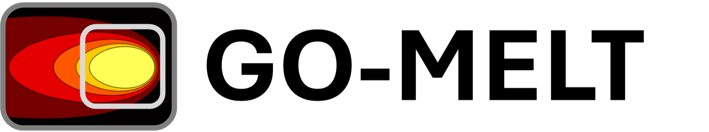

<p align="middle">
  
</p>

A GPU-accelerated framework for multiscale problems using [JAX](https://github.com/google/jax). 

New updates (and reworks) will be introduced in 2025 with the publication of two separate papers. New features will include phase-dependent/temperature-dependent material properties, experimental validation, and gcode reader.

# GO-MELT
GO-MELT, short for GPU-Optimized Multilevel Execution of LPBF Thermal simulations, is a finite element solver used to calculate multiscale problems.

## Installation and First Run
```linux
go_melt_folder=GO_MELT \
&& git clone https://github.com/JLnorthwestern/GO-MELT $go_melt_folder \
&& cd $go_melt_folder \
&& python3.9 -m venv .venv \
&& source .venv/bin/activate \
&& pip3 install -r requirements.txt \
&& python3 go_melt/runtestMultiscale.py
```

## Citations

If you found this library useful in academic or industry work, we appreciate your support if you consider:
1) Starring the project on Github
2) Citing the relevant paper(s):

[GO-MELT: GPU-optimized multilevel execution of LPBF thermal simulations](https://doi.org/10.1016/j.cma.2024.116977).
```bibtex
@article{leonor2024,
  title = {GO-MELT: GPU-optimized multilevel execution of LPBF thermal simulations},
  journal = {Computer Methods in Applied Mechanics and Engineering},
  volume = {426},
  pages = {116977},
  year = {2024},
  issn = {0045-7825},
  doi = {https://doi.org/10.1016/j.cma.2024.116977},
  url = {https://www.sciencedirect.com/science/article/pii/S0045782524002330},
  author = {Joseph P. Leonor and Gregory J. Wagner},
  publisher = {Elsevier}
}
```
