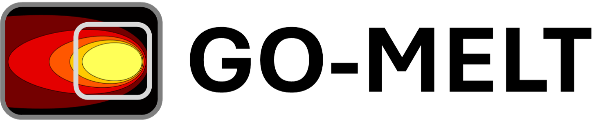

<p align="middle">
  
</p>
A GPU-accelerated framework for multiscale problems using [JAX](https://github.com/google/jax). 

# GO-MELT
GO-MELT, short for GPU-Optimized Multilevel Execution of LPBF Thermal simulations, is a finite element solver used to calculate multiscale problems.

## Citations

If you found this library useful in academic or industry work, we appreciate your support if you consider:
1) Starring the project on Github
2) Citing the relevant paper(s):

```bibtex
@article{leonor2024,
  title={GO-MELT: GPU-Optimized Multilevel Execution of LPBF Thermal simulations},
  author={Joseph P. Leonor and Gregory J. Wagner},
  journal={},
  pages={},
  year={Under Review},
  publisher={}
}
```
